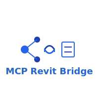

<p align="center">
  
</p>

<h1 align="center">MCP Revit Bridge</h1>

<p align="center">
  Connect MCP clients to Autodesk Revit through a Python server and .NET bridge add-in
</p>

<p align="center">
  <a href="https://github.com/Sam-AEC/mcp/actions"></a>
  <a href="LICENSE"></a>
  <a href="https://github.com/Sam-AEC/mcp/releases"></a>
  <a href="#"></a>
  <a href="#"></a>
  <a href="#"></a>
</p>

---

## What It Is

- **MCP Server**: Python stdio server exposing 25 Revit tools via the Model Context Protocol
- **Revit Bridge**: .NET 4.8 add-in executing Revit API operations through HTTP/ExternalEvent
- **Demo Client**: Example automation workflow running in mock mode (no Revit required) or bridge mode (Windows + Revit)

## Why It Exists

- **Reproducible Automation**: Script Revit workflows from any MCP client (Claude Desktop, custom tools, CI/CD)
- **Auditable Outputs**: Structured logs track every tool invocation with timestamps and artifacts
- **Safe Tool Access**: Workspace sandboxing, schema validation, and mock mode for testing without production models

## Quickstart (Mock Mode)

Run the complete workflow without Revit or Windows.

**Prerequisites**:
- Python 3.11+
- pip

**Steps**:

1. Clone and navigate:
```bash
git clone https://github.com/Sam-AEC/mcp.git
cd mcp
```

2. Install the MCP server:
```bash
pip install -e packages/mcp-server-revit[dev]
```

3. Configure mock mode:
```bash
export MCP_REVIT_MODE=mock
export WORKSPACE_DIR="$(pwd)/workspace"
export MCP_REVIT_ALLOWED_DIRECTORIES="$(pwd)/workspace"
mkdir -p workspace
```

4. Run tests to verify:
```bash
pytest packages/mcp-server-revit/tests
```

5. Start the MCP server:
```bash
python -m revit_mcp_server
```

6. In another terminal, run the demo client:
```bash
python packages/client-demo/demo.py
```

**Expected Output**:
- Health check returns `{"status": "healthy", "mode": "mock"}`
- Mock document opened
- Quantities exported to `workspace/quantities.csv` (stub data)
- Audit log at `workspace/audit.jsonl` with request tracking

## Quickstart (Bridge Mode / Revit)

Connect to a running Revit instance on Windows.

**Prerequisites**:
- Windows 10/11
- Revit 2020-2024 installed
- .NET Framework 4.8
- Visual Studio 2019+ or MSBuild
- Python 3.11+

**Steps**:

1. Complete steps 1-2 from Mock Mode above

2. Set Revit SDK path:
```powershell
$env:REVIT_SDK = "C:\Program Files\Autodesk\Revit 2024\SDK"
```

3. Build the bridge add-in:
```powershell
.\scripts\build-addin.ps1
```

4. Install the add-in:
```powershell
.\scripts\install-addin.ps1 -RevitYear 2024
```

5. Start Revit (the bridge loads automatically and listens on http://localhost:3000)

6. Configure bridge mode:
```powershell
$env:MCP_REVIT_MODE = "bridge"
$env:MCP_REVIT_BRIDGE_URL = "http://localhost:3000"
$env:WORKSPACE_DIR = "C:\revit-workspace"
$env:MCP_REVIT_ALLOWED_DIRECTORIES = "C:\revit-workspace"
```

7. Start the MCP server:
```bash
python -m revit_mcp_server
```

8. Run the demo client:
```bash
python packages/client-demo/demo.py
```

**Expected Output**:
- Real Revit operations execute
- Files created in `C:\revit-workspace\`
- Audit log tracks bridge communications

## Tool Catalog

25 tools across 5 categories. Full documentation: [docs/tools.md](docs/tools.md)

### Example 1: Health Check

```json
// Request
{
  "tool": "revit.health",
  "payload": {"request_id": "health_001"}
}

// Response
{
  "status": "healthy",
  "requests_handled": 1,
  "message": "Bridge ready"
}
```

### Example 2: Export Schedules

```json
// Request
{
  "tool": "revit.export_schedules",
  "payload": {
    "request_id": "export_001",
    "output_path": "C:\\workspace\\schedules.csv"
  }
}

// Response
{
  "schedules": ["Door Schedule", "Window Schedule"],
  "output_path": "C:\\workspace\\schedules.csv"
}
```

### Example 3: QA Audit

```json
// Request
{
  "tool": "revit.naming_standards_audit",
  "payload": {"request_id": "audit_001"}
}

// Response
{
  "issues_found": 12,
  "severity": "warning"
}
```

**All 25 Tools**:
- Health: `revit.health`
- Documents: `revit.open_document`, `revit.list_views`
- QA Audits: `revit.model_health_summary`, `revit.warning_triage_report`, `revit.naming_standards_audit`, and 7 more
- Exports: `revit.export_schedules`, `revit.export_quantities`, `revit.export_pdf_by_sheet_set`, `revit.export_dwg_by_sheet_set`, `revit.export_ifc_named_setup`
- Sheet Automation: `revit.batch_create_sheets_from_csv`, `revit.batch_place_views_on_sheets`, `revit.titleblock_fill_from_csv`
- Baseline Tracking: `revit.baseline_export`, `revit.baseline_diff`

## Security Model

Full details: [docs/security.md](docs/security.md)

- **Workspace Sandbox**: All file operations restricted to configured `allowed_directories`
- **Schema Validation**: Pydantic models validate every tool input before execution
- **Audit Logs**: Structured JSONL logs record requests, responses, and file artifacts
- **Safe Defaults**: Mock mode enabled for CI/CD, bridge listens on localhost only (127.0.0.1:3000)

## Architecture

Full details: [docs/architecture.md](docs/architecture.md)

```
Client → MCP Server (Python) → Bridge (HTTP) → Revit Add-in (.NET) → Revit API
         ↓                       ↓                ↓
     Schema Validation    Workspace Sandbox   ExternalEvent Queue
     Audit Logging        Mock/Bridge Mode    Revit Operations
```

**Why the Bridge?**
- Revit API requires .NET 4.8 and Windows
- ExternalEvent pattern mandates UI thread execution
- HTTP provides clean process boundary and language-agnostic interface
- Mock mode enables CI without Revit dependency

## Roadmap

- Additional QA tools (circulation analysis, clash detection export)
- Enhanced sheet automation (view placement optimization, multi-template support)
- Batch document processing (folder-level operations)
- Package builder (automated .rfa/.addin generation)
- Optional telemetry (disabled by default, opt-in only)
- Async HTTP client for parallel operations

## Contributing

We welcome contributions! See [CONTRIBUTING.md](CONTRIBUTING.md) for guidelines.

**Quick Links**:
- [Installation Guide](docs/install.md)
- [Tool Documentation](docs/tools.md)
- [Security Model](docs/security.md)
- [Architecture Overview](docs/architecture.md)

## Get Involved

- Star the repo if you find it useful
- Open an issue to request new tools or report bugs
- Submit pull requests for tool implementations, test fixtures, or documentation improvements

## License

MIT License. See [LICENSE](LICENSE) for details.

Copyright (c) 2025 MCP Revit Bridge Contributors

## Built With

This project is built using the [mcp-use](https://github.com/mcp-use/mcp-use) framework, which provides a robust foundation for building MCP servers and tools.

